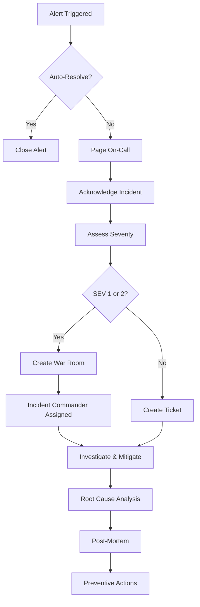

# TeleDoctor - Site Reliability Engineering Practices

## 📋 Overview

This document defines the Site Reliability Engineering (SRE) practices for TeleDoctor Modern, including service level objectives, incident management, on-call procedures, and operational runbooks.

## 🎯 Service Level Objectives (SLOs)

### API Availability

**Objective**: 99.9% uptime (Three nines)

**Measurement Window**: 30 days  
**Error Budget**: 43.2 minutes per month  
**Measurement Method**: Health endpoint checks every 60 seconds

**Acceptable Downtime**:
- Monthly: 43.2 minutes
- Weekly: 10.1 minutes
- Daily: 1.4 minutes

**Monitoring**:
```yaml
Health Check Endpoint: /health
Check Frequency: 60 seconds
Timeout: 5 seconds
Success Criteria: HTTP 200 response
Alert Threshold: 3 consecutive failures
```

### Response Time

**SLO Targets**:
- **P95**: 95% of requests complete in < 200ms
- **P99**: 99% of requests complete in < 500ms
- **P99.9**: 99.9% of requests complete in < 1000ms

**Measurement**: Application Insights telemetry

**Alert Thresholds**:
- Warning: P95 > 250ms for 5 minutes
- Critical: P95 > 500ms for 5 minutes
- Emergency: P99 > 2000ms for 2 minutes

### Data Durability

**SLO**: 99.999% durability (Five nines)

**Implementation**:
- Geo-redundant Azure SQL Database
- Zone-redundant Redis Cache
- Automated backups with 35-day retention
- Point-in-time restore capability

## 🚨 Incident Management

### Severity Levels

#### SEV 1 - Critical
**Definition**: Complete service outage or data loss  
**Examples**:
- API completely unavailable
- Database inaccessible
- Security breach
- Data corruption

**Response Time**: 15 minutes  
**Update Frequency**: Every 30 minutes  
**Stakeholder Notification**: Immediate

**Actions**:
1. Page on-call engineer
2. Create incident channel (#incident-[timestamp])
3. Notify management immediately
4. Activate incident commander

#### SEV 2 - High
**Definition**: Partial service degradation  
**Examples**:
- High error rates (>5%)
- Performance degradation (2x normal latency)
- Single region unavailable
- Critical feature unavailable

**Response Time**: 1 hour  
**Update Frequency**: Every 2 hours  
**Stakeholder Notification**: Within 1 hour

**Actions**:
1. Page on-call engineer
2. Create incident channel
3. Notify team lead
4. Begin investigation

#### SEV 3 - Medium
**Definition**: Minor service impact  
**Examples**:
- Non-critical feature degraded
- Isolated user reports
- Performance issues affecting <10% users

**Response Time**: 4 hours (business hours)  
**Update Frequency**: Daily  
**Stakeholder Notification**: Not required

**Actions**:
1. Notify on-call engineer
2. Create incident ticket
3. Investigate and fix during business hours

#### SEV 4 - Low
**Definition**: Minimal impact  
**Examples**:
- UI glitches
- Non-critical bugs
- Documentation issues

**Response Time**: Next sprint  
**Update Frequency**: Not required  
**Stakeholder Notification**: Not required

### Incident Response Workflow



### Post-Mortem Template

```markdown
# Incident Post-Mortem

## Incident Summary
- **Date**: YYYY-MM-DD
- **Duration**: X hours Y minutes
- **Severity**: SEV X
- **Services Affected**: [List]
- **Impact**: X users affected, $Y revenue loss

## Timeline
- HH:MM - Initial alert triggered
- HH:MM - On-call engineer acknowledged
- HH:MM - Root cause identified
- HH:MM - Mitigation deployed
- HH:MM - Service restored
- HH:MM - Incident closed

## Root Cause
[Detailed technical explanation of what went wrong]

## Contributing Factors
1. Factor 1
2. Factor 2

## Resolution
[How the incident was resolved]

## Lessons Learned

### What Went Well
- 
- 

### What Went Wrong
- 
- 

### Where We Got Lucky
- 
- 

## Action Items
| Action | Owner | Due Date | Priority |
|--------|-------|----------|----------|
| | | | |

## Related Incidents
[Links to related incidents]
```

## 📞 On-Call Procedures

### On-Call Rotation

**Schedule**: 7-day rotation  
**Rotation Time**: Monday 09:00 UTC  
**Coverage**: 24/7/365

**Rotation Structure**:
```yaml
Primary On-Call: 
  - Duration: 1 week
  - Responsibilities: First responder
  
Secondary On-Call:
  - Duration: 1 week
  - Responsibilities: Backup, escalation support

On-Call Manager:
  - Duration: 1 month
  - Responsibilities: Critical escalation, management liaison
```

### Escalation Path

**Level 1** (0-15 min): Primary On-Call Engineer  
**Level 2** (15-30 min): Secondary On-Call Engineer  
**Level 3** (30-60 min): On-Call Manager  
**Level 4** (60+ min): VP Engineering  

### On-Call Compensation

- **Weekday Nights** (22:00-08:00): 1.5x hourly rate
- **Weekends**: 2x hourly rate
- **Public Holidays**: 2.5x hourly rate
- **Time Off**: 1 day off per week on-call

### On-Call Tools

**Required**:
- PagerDuty mobile app
- VPN access (configured)
- Azure Portal access
- Kubernetes CLI (kubectl) configured
- Incident response playbooks bookmarked

**Communication Channels**:
- Primary: PagerDuty
- Secondary: Phone call
- Tertiary: Slack (#on-call-alerts)

## 📊 Capacity Planning

### Resource Monitoring Thresholds

| Resource | Warning | Critical | Auto-Scale Target |
|----------|---------|----------|-------------------|
| CPU Usage | 70% | 85% | 60% |
| Memory Usage | 75% | 90% | 65% |
| Disk Usage | 80% | 95% | 70% |
| Network Bandwidth | 70% | 90% | 60% |
| AKS Node Count | 80% capacity | 95% capacity | 70% capacity |

### Predictive Scaling

**Implementation**:
- Historical data analysis (3-month window)
- Machine learning-based predictions
- Automated scaling recommendations
- Cost-optimized scaling strategies

**Triggers**:
```yaml
Scale Up:
  - CPU > 70% for 10 minutes
  - Memory > 75% for 10 minutes
  - Request queue > 100 for 5 minutes

Scale Down:
  - CPU < 30% for 30 minutes
  - Memory < 40% for 30 minutes
  - During low-traffic hours (02:00-06:00)
```

### Load Testing Schedule

**Regular Testing**:
- **Weekly**: Staging environment baseline test
- **Monthly**: Production-scale load test in staging
- **Quarterly**: Chaos engineering experiments
- **Annually**: Disaster recovery full drill

**Load Test Scenarios**:
```yaml
Baseline Test:
  Users: 1,000 concurrent
  Duration: 30 minutes
  Endpoints: All critical APIs
  
Stress Test:
  Users: 10,000 concurrent
  Duration: 60 minutes
  Target: Find breaking point
  
Spike Test:
  Pattern: 0 to 5,000 users in 1 minute
  Duration: 30 minutes
  Purpose: Test auto-scaling
  
Endurance Test:
  Users: 2,000 concurrent
  Duration: 12 hours
  Purpose: Memory leak detection
```

## 🔄 Change Management

### Deployment Strategy

**Blue-Green Deployments**:
```yaml
Process:
  1. Deploy new version to "Green" environment
  2. Run smoke tests
  3. Route 5% traffic to Green
  4. Monitor for 15 minutes
  5. Route 25% traffic to Green
  6. Monitor for 30 minutes
  7. Route 100% traffic to Green
  8. Keep Blue environment for 24 hours (rollback capability)
  9. Decommission Blue

Rollback Criteria:
  - Error rate > 1%
  - P95 latency > 500ms
  - Any SEV 1 incident
  - Customer escalations
```

**Canary Releases**:
```yaml
Phase 1 (5%):
  Duration: 30 minutes
  Monitoring: Intensive
  
Phase 2 (25%):
  Duration: 2 hours
  Monitoring: Standard
  
Phase 3 (100%):
  Duration: Permanent
  Monitoring: Standard

Success Criteria:
  - Error rate < 0.5%
  - No increase in latency
  - No customer complaints
```

### Maintenance Windows

**Scheduled Maintenance**:
- **Day**: Sunday
- **Time**: 02:00-04:00 UTC (Low traffic period)
- **Frequency**: Weekly
- **Notification**: 72 hours advance notice

**Emergency Maintenance**:
- **Approval Required**: VP Engineering or On-Call Manager
- **Notification**: As soon as possible
- **Communication**: Status page, email, Slack

### Change Approval Process

| Change Type | Approval Required | Testing | Rollback Plan |
|-------------|------------------|---------|---------------|
| Minor (config) | Tech Lead | Unit tests | Automated |
| Medium (feature) | Engineering Manager | Integration tests | Blue-green |
| Major (architecture) | VP Engineering | Full test suite | Manual |
| Emergency (hotfix) | On-Call Manager | Smoke tests | Immediate rollback ready |

## 📈 Performance Monitoring

### Key Metrics (Golden Signals)

**Latency**:
```yaml
Metrics:
  - P50, P95, P99, P99.9 response times
  - Time to First Byte (TTFB)
  - Database query latency
  
Dashboard: Application Insights
Alerts: Configured for P95 > 200ms
```

**Traffic**:
```yaml
Metrics:
  - Requests per second
  - Unique active users
  - Geographic distribution
  
Dashboard: Application Insights
Alerts: Sudden drops > 50%
```

**Errors**:
```yaml
Metrics:
  - Error rate (4xx, 5xx)
  - Exception types and counts
  - Failed authentication attempts
  
Dashboard: Application Insights
Alerts: Error rate > 1%
```

**Saturation**:
```yaml
Metrics:
  - CPU utilization
  - Memory utilization
  - Disk I/O
  - Network bandwidth
  
Dashboard: Azure Monitor
Alerts: > 80% utilization
```

### Synthetic Monitoring

**Health Checks**:
- Global availability monitoring from 10 locations
- Frequency: Every 60 seconds
- Endpoints: /health, /api/health, /api/ready

**Smoke Tests**:
- Critical user journeys (login, appointment booking)
- Frequency: Every 15 minutes
- Alert on 3 consecutive failures

## 🔒 Security Operations

### Security Monitoring

**Tools**:
- Azure Defender for Cloud
- Azure Sentinel (SIEM)
- Network Watcher
- Application Insights Security

**Alerts**:
- Failed authentication attempts (> 10 in 5 minutes)
- Unusual traffic patterns
- Data exfiltration attempts
- Privilege escalation

### Incident Response - Security

**SEV 1 Security Incidents**:
1. Isolate affected systems immediately
2. Notify security team and management
3. Preserve evidence
4. Engage incident response team
5. Notify customers if data breach (GDPR compliance)
6. Regulatory reporting (within 72 hours)

## 📚 Operational Runbooks

### Common Procedures

#### Database Failover
```bash
# 1. Verify primary is down
az sql db show --name teledoctor-db --resource-group rg-teledoctor-prod

# 2. Initiate failover to secondary region
az sql failover-group set-primary \
  --name teledoctor-fog \
  --resource-group rg-teledoctor-prod \
  --server sql-teledoctor-secondary

# 3. Update connection strings in Key Vault
az keyvault secret set \
  --vault-name kv-teledoctor-prod \
  --name sql-connection-string \
  --value "new-connection-string"

# 4. Restart application pods
kubectl rollout restart deployment/teledoctor-api -n production
```

#### Scale AKS Cluster
```bash
# Scale user node pool
az aks nodepool scale \
  --resource-group rg-teledoctor-prod \
  --cluster-name aks-teledoctor-prod \
  --name application \
  --node-count 10
  
# Verify scaling
kubectl get nodes
kubectl top nodes
```

#### Clear Redis Cache
```bash
# Connect to Redis
az redis force-reboot \
  --name redis-teledoctor-prod \
  --resource-group rg-teledoctor-prod \
  --reboot-type AllNodes

# Verify connectivity
redis-cli -h redis-teledoctor-prod.redis.cache.windows.net \
  -p 6380 -a $REDIS_KEY --tls ping
```

## 📞 Contact Information

**On-Call Escalation**:
- Primary: PagerDuty
- Phone: +47 XXX XX XXX
- Email: oncall@teledoctor.no

**Team Contacts**:
- Infrastructure Team: infrastructure@teledoctor.no
- Security Team: security@teledoctor.no
- DevOps Lead: devops-lead@teledoctor.no

---

**Document Version**: 1.0  
**Last Updated**: 2024  
**Owner**: SRE Team  
**Review Frequency**: Quarterly

